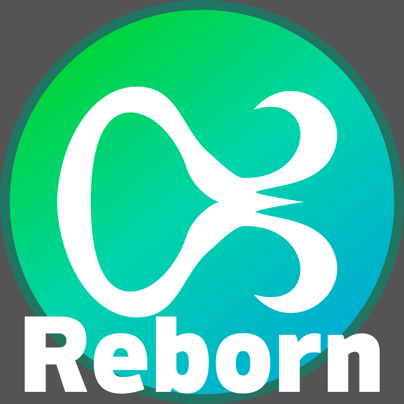

# Amecs Reborn

A Minecraft Fabric mod that allows to you add key modifiers (e.g. shift or control) to every keybinding. Now ported to 1.21 with new features!

**&nbsp;
[Modrinth](https://modrinth.com/mod/amecs-reborn)
[Discord](https://discord.gg/YH3hw926hz)
&nbsp;**

### Whoa? Where's my Git History.

This repo temporarily just contains the code without the associated git history from Amecs and Amecs-API. Rest assured that it is my goal to integrate such Git history, but in the mean time, it’s better to have the code here than not at all. It may take me a little while to integrate the history, since it’s not a simple feat merging two Git repos. Hopefully I should have the full git history restored soon.

## Features

- Allows you to add modifiers to every Keybinding
  - Supports Control, Shift, Alt/Option, and Windows/Super/Command
- A search bar for the controls menu
- Full compatability with Controlling
- Alternate escape Keybind option
- Keybinds for toggling auto jump and your skin layers
- An options menu to disable non-core features

## About this fork

Amecs-Reborn is a fork/merger of Amecs and Amecs-Api by Siphalor. Unfortunately, Siphalor stopped maintaining the Amecs projects,
and so I stepped in to port them to 1.21. Along the way, I took the time to make some improvements including merging the code bases (info on my rational for this can 
be found at the end), adding support for the Windows/Super/Command key, adding in platform specific translations for key names using a purpose built library, adding in toggles
for the mod's features, and adding full support for Controlling. I have even more stuff in the pipeline possibly including the potential for custom modifier keys.

## License

This mod is licensed under [the Apache 2.0 license](./LICENSE).

## Stuff for Developers

Amecs also has keybind utilities that developers can make use of. These are detailed below

### Modifier Keys

Modifier keys can be set by the user for all keybindings, including Vanilla ones.

If you want to define a keybinding that uses modifier keys for its default value, you can extend the [`AmecsKeyBinding`](./src/main/java/de/siphalor/amecs/api/AmecsKeyBinding.java) class.

If you want to further integrate this mod, check the [`KeyBindingUtils`](./src/main/java/de/siphalor/amecs/api/KeyBindingUtils.java) class.

### Priority Keybindings

Priority keybindings are keybindings that are executed before all other keybindings and are allowed to cancel further evaluation.  
This has various use cases, for example:

- Keybindings that work when not in-game
- Keybindings that work regardless if the chat or a GUI is open

You can make use of priority keybindings by implementing the [`PriorityKeyBinding`](src/main/java/de/siphalor/amecs/api/PriorityKeyBinding.java) interface.

Please always carefully check if your priority keybinding takes action in the right context.  
For example, you oftentimes don't want to execute your priority keybinding when the chat is open.

### Keybinding Descriptions

Keybinding descriptions are a way to provide a description for a keybinding that are shown as a tooltip when hovering over the keybinding in the controls menu.

You can add descriptions by defining translations for the keybinding's translation key with the suffix `.amecs.description`.

### So why did you merge the projects together?

To me, it never really made sense that Amecs and Amecs-API were separate projects. This is because
Amecs-API was not actually an API for interfacing with Amecs, it effectively was Amecs. It was in Amecs-API, not
Amecs that that key modifier features resided. Amecs provided some features on top of this, but the core reason
people use it, the modifiers, was in Amecs-API. Since the mod's core feature was in a library branded after the mod,
it did not really make sense to have both the library and the mod, especially since the library's functions are inseparable
from the stated purpose of Amecs. If you had Amecs-API installed through some other means, you would still have the core stated
feature of Amecs. This, combined with the fact that one codebase is easier to maintain than two, and the fact that I added feature toggles
for the features formerly in the Amecs package, made me want to merge the projects and feel comfortable doing so. If you are a developer who
wants to use the features that were formerly in Amecs-API but don't like the way this mod is packaged, please reach out so we can discuss a solution. - Cheeze
